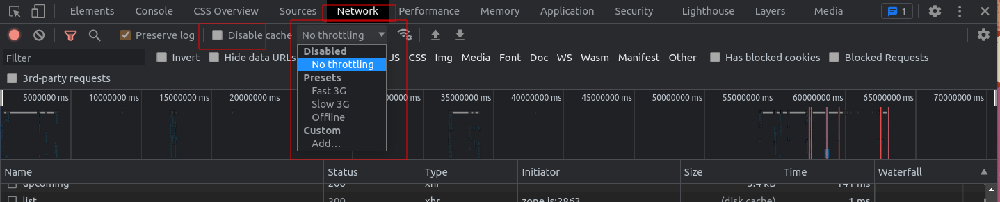

# State Management

## Local State

### 03 manage list state

go to `src/app/pages/movie-list-page.component.ts`

Introduce `MovieListState` interface

```ts
// movie-list-page.component.ts

interface MovieListState {
  movies: MovieModel[];
  loading: boolean;
  error: any;
}
```

Introduce `RxState<MovieListState>` & `viewModel$` 

```ts
// movie-list-page.component.ts

export class MovieListPageComponent
  extends RxState<MovieListState> {
  
  viewModel$ = this.select();
    
  constructor(
    private route: ActivatedRoute,
    private movieData: MovieDataService
  ) {
    super();
  }
}
```

Start with implementing `loading` state

```ts
// movie-list-page.component.ts

private movieListState$ = this.routerParams$.pipe(
  switchMap(({ identifier, type }) => {
    let data$ = this.movieData.getMovieGenre(identifier);
    if (type === 'category') {
      data$ = this.movieData.getMovieCategory(identifier);
    }
    return data$.pipe(
      map(response => ({ movies: response.results })),
      startWith({ loading: true }),
      endWith({ loading: false })
    );
  })
);

ngOnInit() {
  this.connect(this.movieListState$);
}
```

Introduce the `viewModel$` to the template and show the `loader` based on the loading state value: 

```angular2html
<!-- movie-list-page.component.html -->

<div class="padding-wrapper" *ngIf="viewModel$ | async as vm">
  <app-loader *ngIf="vm.loading; else: movieList"></app-loader>
  <ng-template #movieList>
    <app-movie-list [movies]="vm.movies"></app-movie-list>
  </ng-template>
</div>
```

Confirm that the loader is shown when you navigate between movie-lists. Consider
using chrome-devtools `network throttling` for debugging purposes.



Let's implement the refresh functionality.

We start by adding the trigger to refresh to our component

```ts
// movie-list-page.component.ts

// trigger for refreshing movies
private loadMovies$ = new Subject<void>();

// a function to be invoked by the UI
loadMovies() {
  this.loadMovies$.next();
}
```

With the trigger in place, we can already implement the state transition.
When the trigger emits a new value, we want to again call `this.movieData.getXy`.

```ts
// movie-list-page.component.ts

private movieListState$ = this.routerParams$.pipe(
  switchMap(({ identifier, type }) => {
    let data$ = this.movieData.getMovieGenre(identifier);
    if (type === 'category') {
      data$ = this.movieData.getMovieCategory(identifier);
    }
    // subscribe to loadMoviesTrigger
    return this.loadMovies$.pipe(
      // start with an empty value to instantly fetch the data  
      startWith(null),
      // ignore subsequent calls to re-fresh trigger until a value arrives
      exhaustMap(() => {
        return data$.pipe(
          map(response => ({ movies: response.results })),
          startWith({ loading: true }),
          endWith({ loading: false })
        );
      })
    );
  })
);
```

Implement the UI for the refreshTrigger in the component template.

```angular2html
<!-- movie-list-page.component.html -->

<div class="padding-wrapper" *ngIf="viewModel$ | async as vm">
  <!-- call the triggerfunction -->
  <button (click)="loadMovies()">refresh list</button>
  
  <app-loader *ngIf="vm.loading; else: movieList"></app-loader>
  <ng-template #movieList>
    <app-movie-list [movies]="vm.movies"></app-movie-list>
  </ng-template>
</div>
```

Run the application, test if the refresh flow works. Consider using the devtools again to throttle
the network speed.

For the sake of completeness, we also want to take care of the `error` state.

```ts
private movieListState$ = this.routerParams$.pipe(
  switchMap(() => {
    // ...
    return this.loadMovies$.pipe(
      startWith(null),
      exhaustMap(() => {
        return data$.pipe(
          map(response => ({ movies: response.results })),
          // catch the error and return it as state slice
          // reset the movies slice to an empty array
          catchError(e => of({ error: e, movies: [] })),
          // reset the error to null start
          startWith({ loading: true, error: null }),
          endWith({ loading: false })
        );
      })
    );
  })
);
```

Now that we have the error state, let's implement a `side-effect`
which displays an alert to the user after an error occurred.

```ts
// movie-list-page.component.ts

ngOnInit() {
  // ...
  this.hold(
    // trigger for the side-effect is the error state
    this.select('error'),
    error => {
      // if we encounter an error, we display a message to the user
      if (error) {
        alert(error.message);
      }
    }
  )
}
```

**Bonus: re-usable fetch snippet**

Create a re-usable function for the managing error, loading and data streams and
use it in `movie-list-page.component.ts`.

Example:

```ts

function exhaustFetch<T extends FetchState>(
  trigger$: Observable<void>,
  data$: Observable<Partial<T>>
): Observable<Partial<T>> {
  return trigger$.pipe(
    startWith(null),
    exhaustMap(() => {
      return data$.pipe(
        catchError(e => of({ error: e} as Partial<T>)),
        startWith({ loading: true, error: null } as Partial<T>),
        endWith({ loading: false } as Partial<T>)
      );
    })
  )
}

// usage:

private movieListState$ = this.routerParams$.pipe(
  switchMap(({ identifier, type }) => {
    let data$ = this.movieData.getMovieGenre(identifier);
    if (type === 'category') {
      data$ = this.movieData.getMovieCategory(identifier);
    }
    return exhaustFetch<MovieListState>(
      this.loadMovies$,
      data$.pipe(map(response => ({
        movies: response.results
      })))
    )
  })
);
```
