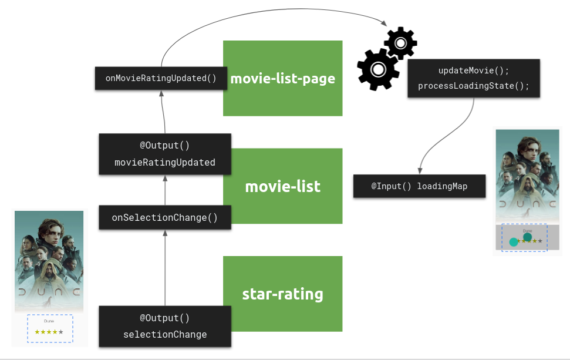

# State Management

## Local State



### 04 manage list state with per-item update

go to `src/app/ui/atoms/star-rating/star-rating.component.ts`

Let's start by extending the star-rating component. We want users to be able to 
click on a star and show the selected value as first item.

```ts
// star-rating.component.ts

selectedStar = 0;

onStarSelect(star: number) {
  this.selectedStar = star;
}
```

additionally, introduce an `@Output()` to inform other components about the change.

```ts
// star-rating.component.ts

@Output() readonly selectionChange = new EventEmitter<number>();

onStarSelect(star: number) {
  this.selectedStar = star;
  this.selectionChange.next(star);
}
```

call the function from the template and show the selected star

```html
// star-rating.component.ts

<div class="stars">
  <!-- show selected star -->
  <span *ngIf="selectedStar" class="star">{{ selectedStar }}</span>
  <!-- for simplicity we just use the index as star value -->
  <span
    *ngFor="let fill of stars; let i = index; trackBy: trackByIndex"
    class="star"
    (click)="onStarSelect(i + 1)"
    [ngClass]="{
            'star-half': fill === 0,
            'star-empty': fill === -1
          }"
    style
  >★</span
  >
</div>
```

Run the application and check if the new feature is actually working as expected.

Next, we want to pass through the `selectionChange` event to the place where we actually
have contact to the `DataService`. 
For this, we need to pass the `selectionChange` event from `movie-list.component`
to `movie-list-page.component`

go to `src/app/ui/components/movie-list.component.ts`

Define an `@Output()` to pass through the event and enrich it with information about the
actual `Movie` we wannt to update.

```ts
// movie-list.component.ts

@Output() ratingUpdated = new EventEmitter<{
  movie: MovieModel;
  rating: number;
}>();
```

```html
<!-- movie-list.component.html -->

<!-- $event.stopPropagation() to not trigger routing when clicking details -->
<div class='movies-list--grid-item__details'
     (click)="$event.stopPropagation()">
  <h2 class='movies-list--grid-item__details-title'>
    {{ movie.title }}
  </h2>
  <!-- use the selectionChange event and enrich it with information -->
  <app-star-rating
    (selectionChange)="ratingUpdated.emit({ movie: movie, rating: $event })"
    [rating]='movie.vote_average'></app-star-rating>
</div>
```

Now we are ready to send the value to our smart-component.

**Optional: if not checkout out this branch**

If you have not checked out this branch, we need to first introduce the method
`updateMovieRating` to `MovieDataService`.

go to `src/app/data-access/api/movie-data.service.ts`.

```ts
// movie-data.service.ts

// just a mock
updateMovieRating = (
  movieId: number,
  rating: number
): Observable<any> => timer(2500);
```

Let's prepare the update trigger and the state transition in our smart-component.

go to `src/app/pages/movie-list-page.component.ts`

```ts
// movie-list-page.component.ts

private updateMovieRating$ = new Subject<{ movie: MovieModel; rating: number}>();

movieRatingUpdated(update: { movie: MovieModel, rating: number }) {
  this.updateMovieRating$.next(update);
}

ngOnInit() {
  // ...
  // register the update as side-effect
  this.hold(
    this.updateMovieRating$.pipe(
      mergeMap(({ movie, rating }) => {
        return this.movieData.updateMovieRating(movie.id, rating);
      })
    )
  );
}
```

As final step, we need to connect the `ratingUpdated` output to our change trigger:

```html
<!-- movie-list.component.html -->
<app-movie-list
  (ratingUpdated)="movieRatingUpdated($event)"
  [movies]="vm.movies"></app-movie-list>
```

We are now able to perform an update request per list-item as side-effect.

### Bonus: per-item loading state

Let's try to improve the UX by introducing a loading state while performing the update
which indicates progress to our users.

Let's first find a valid data-structure to store our per-item loading state and extend 
our local state interface.

Since we want to have optimal reading speed in the template, I would consider using a
`Map` like structure.

```ts
// movie-list-page.component.ts

interface MovieListState {
  movies: MovieModel[];
  loading: boolean;
  error: any;
  updating: Record<string, boolean>; // map of movieIds => boolean (updating)
}
```

What we want to do now, is to set the loading state of a movie id to true when
the request gets send and turn it back to false when the response is here.

```ts
// movie-list-page.component.ts

ngOnInit() {
  //...
  // change hold to connect, since we now want to connect something to the state
  // instead of registering a pure side-effect
  this.connect(
    this.updateMovieRating$.pipe(
      mergeMap(({ movie, rating }) => {
        return this.movieData.updateMovieRating(movie.id, rating).pipe(
          // the request is finished here
          map(() => ({ updating: {
              ...this.get('updating'), // don't lose old values
              [movie.id]: false // set movie.id to false
            }
          })),
          // start with a loading true value
          startWith({ updating: {
              ...this.get('updating'), // don't lose old values
              [movie.id]: true // set loading to true
            }
          }),
        );
      })
    )
  );
}
```

we have now a loading map for movies as `Record<string, boolean>`, let's use it in the 
template to reflect that state in the view.

go to `src/app/ui/components/movie-list/movie-list.component.ts` and add an `@Input()`
to hand over the loading map.

```ts
// movie-list.component.ts

@Input() movieLoading: Record<string, boolean> = {};

```

do the handover in `movie-list-page.component.html`

```html
<!-- movie-list-page.component.html -->

<ng-template #movieList>
  <app-movie-list
    [movieLoading]="vm.updating"
    (ratingUpdated)="movieRatingUpdated($event)"
    [movies]="vm.movies"></app-movie-list>
</ng-template>
```

finally, show a loading component in `movie-list.component.html` and adjust the 
styling to make it look somewhat decent.

```html
<!-- movie-list.component.html -->

<div class='movies-list--grid-item__details' (click)="$event.stopPropagation()">
  <!-- show loader component when movie is loading -->
  <app-loader *ngIf="movieLoading && movieLoading[movie.id]"></app-loader>
  <!-- item content -->
</div>
```

```sass
// movie-list.component.scss

app-loader {
  position: absolute;
  top: 0;
  right: 0;
  bottom: 0;
  left: 0;
  background: var(--palette-action-disabled);
  min-height: unset;
  z-index: 2;
  user-select: all;
}
```

### Bonus+: implement customAccumulator

Let's simplify our code in `movie-list-page.component.ts` and implement
a re-usable utility function to handle `Map` structures.
This way we can get rid of our `don't lose old values` hack.

```ts
map(() => ({ updating: {
    ...this.get('updating'), // don't lose old values
    [movie.id]: false // set movie.id to false
  }
})),
// start with a loading true value
startWith({ updating: {
    ...this.get('updating'), // don't lose old values
    [movie.id]: true // set loading to true
  }
}),
```

The goal is to transition the above snippet of code into something like:

```ts
startWith({ updating: { [movie.id]: true } }),
endWith({ updating: { [movie.id]: false } })
```

For this, let's introduce a `customAccumulator` which will handle deepMerging for us.

create `deep-merge-accumulator.ts` util file in `src/app/shared/utils`

Simple version, only works for scenarios where configured keys are set.

```ts
set({ updating: [id]: true }) // possible;
set({ updating: [id]: true, movies: [] }) // corrupt state;
```

```ts
// deep-merge-accumulator.ts

import { AccumulationFn } from '@rx-angular/state/lib/cdk';

export function createSimpleDeepMergeAccumulator<T>(keys: (keyof T)[]) {
  return ((state: T, update: Partial<T>) => {
    // look for configured keys having a value
    const theKeysArray = keys.filter(i => update[i] != null);
    if (theKeysArray.length) {
      // we need to perform deepMerge
      const newUpdate = theKeysArray.reduce(
        (acc, i) => ({ ...acc, [i]: { ...state[i], ...update[i] } }),
        {}
      );
      // return updated state
      return { ...state, ...newUpdate };
    }
    // return default accumulator
    return { ...state, ...update };
  }) as AccumulationFn;
}
```

more sophisticated version, works for all scenarios

```ts
// deep-merge-accumulator.ts

import { AccumulationFn } from '@rx-angular/state/lib/cdk';

export function createDeepMergeAccumulator<T>(keys: (keyof T)[]) {
  return ((state: T, update: Partial<T>) => {
    const customKeys = keys.filter((i) => update[i] != null);
    const hasCustomAccumulators = customKeys.length > 0;
    
    if (hasCustomAccumulators) {
      const keysSet = new Set(customKeys);
      const patchedUpdate = Object.keys(update).reduce((result, key) => {
        const updateKey = key as keyof T;
        
        if (keysSet.has(updateKey)) {
          const currentValue = state[updateKey];
          const patch = update[updateKey];
          return { ...result, [updateKey]: { ...currentValue, ...patch } };
        }
        
        return { ...result, [updateKey]: update[updateKey] };
      }, {} as Partial<T>);
      
      return { ...state, ...patchedUpdate };
    }
    
    return { ...state, ...update };
  }) as AccumulationFn;
}
```


use the accumulator in `movie-list.component.ts`

```ts
// movie-list-page.component.ts

 constructor(
    private route: ActivatedRoute,
    private movieData: MovieDataService
  ) {
    super();
    this.setAccumulator(createDeepMergeAccumulator(['updating']));
    this.set({
      loading: true,
      updating: {},
      error: null,
      movies: []
    });
  }
  
ngOnInit() {
  this.connect(
    this.updateMovieRating$.pipe(
      mergeMap(({ movie, rating }) => {
        return this.movieData.updateMovieRating(movie.id, rating).pipe(
          startWith({ updating: { [movie.id]: true  }}),
          endWith({ updating: { [movie.id]: false  }})
        );
      })
    )
  );  
}
```
